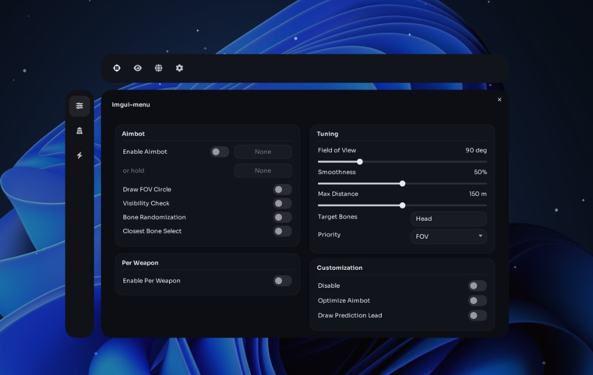
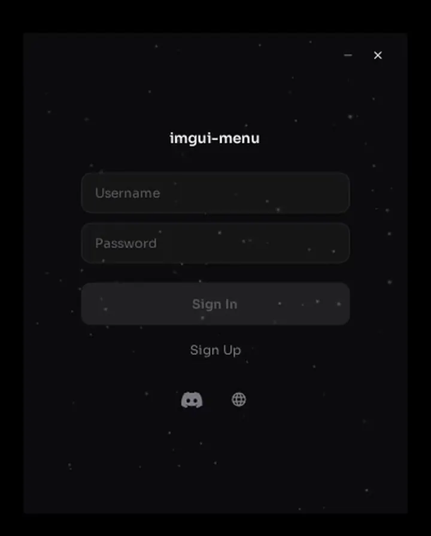
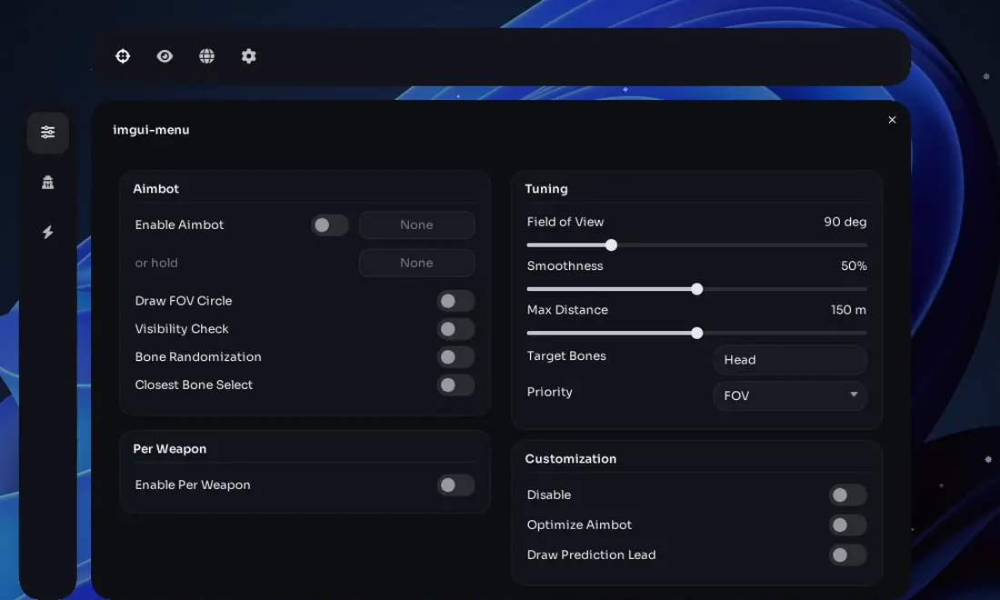

# imgui-menu

Win32 + Direct3D 11 + Dear ImGui. Login, loader, then a floating overlay.

C++20 · Win32 · D3D11 · ImGui

[Download imgui-menu.exe](https://github.com/ff0l/imgui-menu/releases/download/v1.0.0/imgui-menu.exe) · [Release](https://github.com/ff0l/imgui-menu/releases/latest)



Custom theme, glass panels, shared widgets. Built it because default ImGui looks like default ImGui.

## What it does

- Win32 window + Direct3D 11 renderer
- Login / sign-up with screen transitions
- Loader / session UI
- Overlay menu (settings, visuals, related tabs)
- Shared widgets: toggles, sliders, keybinds, color pickers
- Particle system (drift, depth, blur)
- Fonts and icons baked in
- Prebuilt x64 binary in [`dist/imgui-menu.exe`](dist/imgui-menu.exe) and on [v1.0.0](https://github.com/ff0l/imgui-menu/releases/tag/v1.0.0)

## Layout

```
src/
  Application/     entry + screen flow
  Renderer/        D3D11 device, swap chain, textures
  Window/          Win32, layered overlay, input
  UI/
    Authentication/
    Components/    buttons, inputs, glass, chrome
    Loader/
    Menu/          shared controls
    Particles/
    Screens/
    Theme/
  Utilities/
assets/
third_party/       Dear ImGui, stb
dist/              imgui-menu.exe
```

## Build

Windows 10+, VS 2022 (C++ desktop), Windows SDK 10.0.

```bat
msbuild imgui-menu.sln /p:Configuration=Release /p:Platform=x64
```

Output: `build\x64\Release\imgui-menu.exe`

Or open the sln and build **Release | x64**.

## Run

```bat
dist\imgui-menu.exe
dist\imgui-menu.exe --menu
```

`--menu` skips login.

## Preview

Login and menu clips. They loop.

### Login



### Menu


